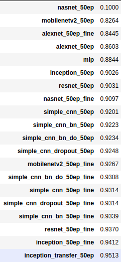

# FashionMnist

`Fashion-MNIST` veriseti [Zalando Research](https://www.kaggle.com/zalando-research/fashionmnist) tarafından MNIST verisetine alternatif olarak oluşturulmuştur. 
Toplamda 60.000 tane eğitim, 10.000 tane test verisi bulunmaktadır. 28x28 gri seviyesinde 10 farklı sınıftan oluşmaktadır.

### Sonuçlar

Sınıflar:

| Label | Class 	|
| ----- |:-------------:|
| 0 	| T-shirt/top 	|
| 1 	| Trouser 	|
| 2 	| Pullover 	|
| 3 	| Dress 	|
| 4 	| Coat 		|
| 5 	| Sandal 	|
| 6 	| Shirt 	|
| 7 	| Sneaker 	|
| 8 	| Bag 		|
| 9 	| Ankle boot 	|

## Kurulum - Çalıştırma
### Docker kurulumu
sudo apt-get update 
sudo apt-get install apt-transport-https ca-certificates curl software-properties-common 
curl -fsSL https://download.docker.com/linux/ubuntu/gpg | sudo apt-key add -  
sudo add-apt-repository "deb [arch=amd64] https://download.docker.com/linux/ubuntu $(lsb_release -cs) stable" 

sudo apt-get update  
sudo apt-get install docker-ce  

Aşağıdaki komut çalışıyorsa sistem hazırdır:  

sudo docker run hello-world   

### Keraslı image oluşturulması
cd docker  
docker build --no-cache=true -t docker_cpu:latest .   

### Keraslı containerın oluşturulması
docker run -it -p 8888:8888 -v ~/Desktop/Fashion_Mnist:/home/code docker_cpu:latest  

-v komutu ile local makinede çalışacağımız konumu belirtiyoruz  

Container çalışırken konsola token değerini basacaktır, localhost:8888 adresine giderek basılan token değerini yapıştırarak girebiliriz   

### Eğitim

Veriseti indirildikten sonra, 
normal eğitim için training.ipynb 
Early stopping, data augmentation ve ReduceLROnPlateau ile yapılan eğitim için training_with_improv.ipynb 
Transfer learning için pre_trained_tuning.ipynb 
çalıştırılabilir.  

### Sonuçlar

